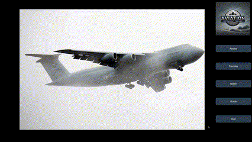
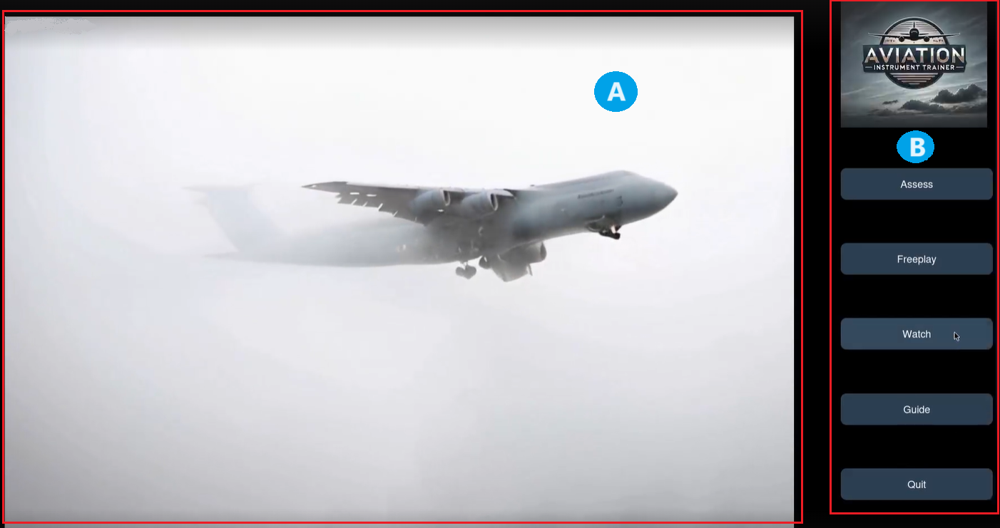
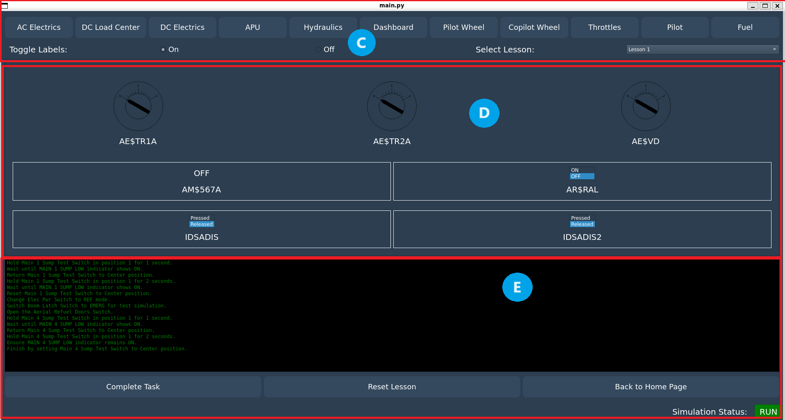
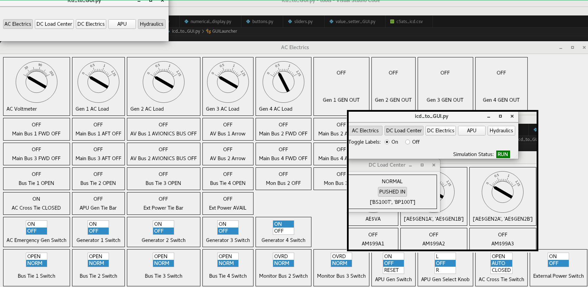

# Project Description

<b> Disclaimer:</b> Due to copyright and security requirements that must be adhered to by Cymstar and all involved parties, sharing the code used in the development of the application is not permitted.

Welcome to the Aviation Instrument Trainer project. This repository contains general information for an easy-to-use visual aviation instrument trainer developed in conjunction with CymSTAR.

This project aims to develop a scalable and interactive training environment for new students learning complex aircraft systems. It will establish an architectural framework for aircrew training, allowing them to learn and master tasks before using full-flight simulators or aircraft.
The solution aims to enhance training methods for the USAF.

## Tech Stack Used in this Project

| Category   | Name                                                                            |
| ---------- | ------------------------------------------------------------------------------- |
| Languages  | Python                                                                          |
| Frameworks | PySide2 & PySide6 (QtWidgets, QtCore, QtGui, QtMultimedia, QtMultimediaWidgets) |
| Libraries  | pandas                                                                          |
|            | math (isnan)                                                                    |
|            | pprint (pprint)                                                                 |
|            | pyshm_local                                                                     |
| Tools      | sys                                                                             |
|            | os                                                                              |
|            | subprocess                                                                      |
|            | csv                                                                             |

## Repository Main Files

| File Name        | Description                                                                                                                                                                                                                                                                                                                                                                |
| ---------------- | -------------------------------------------------------------------------------------------------------------------------------------------------------------------------------------------------------------------------------------------------------------------------------------------------------------------------------------------------------------------------- |
| requirements.txt | The file contains a list of the Python dependencies needed for the project to function correctly.                                                                                                                                                                                                                                                                          |
| homepage.py      | It defines two main classes: TutorialWindow and HomePage. TutorialWindow is a simple window to display tutorial video links. HomePage is the main window that plays a video and has buttons for different actions like "Assess", "Freeplay", "Watch", "Guide", and "Quit".                                                                                                 |
| main.py          | This is the main script that ties everything together, it was the code provided by CymStar and was modified during the development of the project. It sets up the GUI for different modes (Assess, Guide, Freeplay), reads an ICD (Interface Control Document) file to get IO configurations, and initializes panels and widgets for displaying and interacting with data. |
| analogGauge.py   | This code was provided by CymStar. It defines a GaugeWidget class that creates a graphical widget to display a value from shared memory using an analog gauge.                                                                                                                                                                                                             |
| pyshm_local.py   | This code was provided by CymStar. It defines a class Pylocalshm that handles the initialization and manipulation of shared memory variables. It includes methods to initialize memory, set simulation status, add labels, read from and write to shared memory, and more.                                                                                                 |
| icd.csv          | It contains information about devices and panels related to a control system.                                                                                                                                                                                                                                                                                              |
| lessonX.csv      | The lesson files (1,2,3,4,5) are designed to guide users through a series of steps that must be followed to complete a lesson or procedure.                                                                                                                                                                                                                                |
| Other files      | There is additional documentation in the other folders.                                                                                                                                                                                                                                                                                                                    |

✨Graphical Panel Interface ✨

A. initial video  
B. menu option

- Assess
- Freeplay
- Watch
- Guide
- Quit

This is the general view of the panel interface that the user interacts with.

C. Gauges & Widgets panel selection  
D. Gauges & Widgets location section  
E. Lesson task steps

✨ General Gauge Panel ✨

## Contributors

- [Aaron Bell](https://github.com/Caaronbll)
- [Alex Dipboye](https://github.com/Tribeoftech)
- [Braden Earnest](https://github.com/BradenE19)
- [Josh Davis](https://github.com/JD037)
- [Carlos Alarcon](https://github.com/carlalap)
